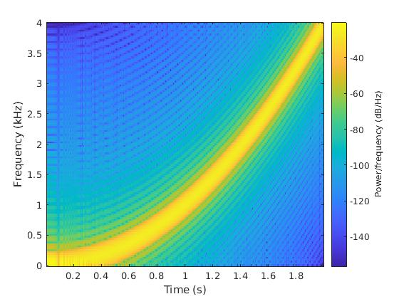

# Digital Signal Processing

**Laboratories Schedule**
* Sampling and Aliasing
* Digital Fourier Transform
* Filtering
* Energy
* Maximum Likelihood Estimations

**Aditional information:**
The first assignment the deadline is one week after the lab, as for the others the deadline is the same day as the lab session.

**Overleaf Link**
https://www.overleaf.com/7733867135hqwvnhpfvyqh
